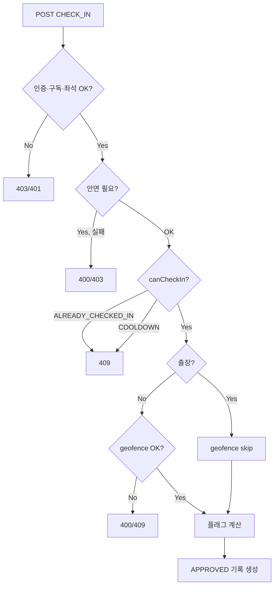
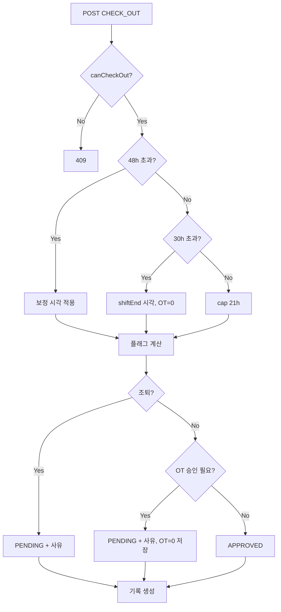

# HeresNow 출퇴근(펀치) 로직

> 최종 갱신: 2026-09-14  
> 대상: 개발자 · 운영 담당자

---

## 목차

1. [개요](#1-개요)
2. [데이터 모델](#2-데이터-모델)
3. [핵심 파일 맵](#3-핵심-파일-맵)
4. [시간 상수](#4-시간-상수)
5. [근무표 해석](#5-근무표-해석)
6. [출근 가능 여부](#6-출근-가능-여부)
7. [퇴근 가능 여부 및 시각 보정](#7-퇴근-가능-여부-및-시각-보정)
8. [근무 플래그 (지각·조퇴·초과·휴일)](#8-근무-플래그-지각조퇴초과휴일)
9. [초과 근무 정책](#9-초과-근무-정책)
10. [자유 출퇴근 모드](#10-자유-출퇴근-모드)
11. [승인·예외 처리](#11-승인예외-처리)
12. [지오펜스](#12-지오펜스)
13. [안면 인증](#13-안면-인증)
14. [API 레퍼런스](#14-api-레퍼런스)
15. [에러 코드](#15-에러-코드)
16. [엣지 케이스 요약](#16-엣지-케이스-요약)
17. [MVS 연동](#17-mvs-연동)
18. [시나리오 예시](#18-시나리오-예시)

---

## 1. 개요

HeresNow의 출퇴근은 **이벤트 스트림 모델**입니다.

- `AttendanceRecord` 테이블에 `CHECK_IN` / `CHECK_OUT` 레코드가 시간순으로 쌓입니다.
- **현재 출근 중인지**는 별도 플래그가 아니라 **마지막 레코드의 type**으로 판단합니다.
- 마지막이 `CHECK_IN` → 출근 중 / 마지막이 `CHECK_OUT` 또는 없음 → 미출근

### 처리 파이프라인

```
인증 · 구독 · 좌석 검증
  → 요청 body 검증 (Zod)
  → 안면 인증 (설정 시)
  → 출퇴근 가능 여부 (eligibility)
  → 지오펜스 · 근무지 선택
  → 근무표 해석
  → 퇴근 시각 보정 (21h / 30h / 48h)
  → 근무 플래그 계산 (지각·조퇴·OT)
  → 승인 사유 검증
  → DB 트랜잭션 (advisory lock + 레코드 생성)
  → MVS 아웃박스 (비동기)
```

---

## 2. 데이터 모델

### AttendanceRecord

| 필드 | 설명 |
|------|------|
| `type` | `CHECK_IN` \| `CHECK_OUT` |
| `timestamp` | 실제 기록 시각 (보정 후) |
| `status` | `APPROVED` \| `PENDING` \| `REJECTED` |
| `isLate` / `lateMinutes` | 지각 여부·분 |
| `isEarlyLeave` | 조퇴 여부 |
| `isOvertime` / `overtimeMinutes` | 초과 근무 여부·분 |
| `isHolidayWork` | 휴일 근무 |
| `isBusinessTrip` | 출장 출근 |
| `outsideGeofence` | 지오펜스 경고 후 확인 퇴근 |
| `recordTimezone` | 기록 시점 회사 TZ 스냅샷 |

### AttendanceException

조퇴·초과 근무 등 **승인 대기** 시 생성됩니다.

| 필드 | 설명 |
|------|------|
| `status` | `PENDING` → `APPROVED` \| `REJECTED` |
| `reason` | 직원이 입력한 사유 |

### WorkRequest (근태 신청)

사전 **조기 퇴근** / **초과 근무** 신청. 초과 근무는 `AFTER_APPROVAL` 모드에서만 가능합니다.

---

## 3. 핵심 파일 맵

| 파일 | 역할 |
|------|------|
| `lib/attendancePunchRules.ts` | 출퇴근 가능 여부, 쿨다운, 48h/30h/21h 보정 |
| `lib/companyWorkSchedule.ts` | 지각·조퇴·OT·휴일 플래그 계산 |
| `lib/overtimePolicy.ts` | AUTO / AFTER_APPROVAL, 60분 유예 |
| `lib/employeeWorkSchedule.ts` | 직원별 근무표 해석 |
| `lib/siteGeofence.ts` | 지오펜스 정책 |
| `lib/attendanceSiteContext.ts` | GPS 기준 최근접 근무지 |
| `lib/faceMatch.ts` | 안면 descriptor 매칭 |
| `lib/attendanceLock.ts` | PostgreSQL advisory lock (동시 펀치 방지) |
| `app/api/attendance/route.ts` | `POST` — 메인 펀치 API |
| `app/api/attendance/status/route.ts` | `GET` — 클라이언트 상태 |
| `app/api/admin/exceptions/[id]/route.ts` | 예외 승인/반려 |
| `components/employee/PunchCard.tsx` | 출퇴근 UI |

---

## 4. 시간 상수

| 상수 | 값 | 용도 |
|------|-----|------|
| `MIN_PUNCH_GAP_MS` | **3분** | 출근 직후 즉시 퇴근 방지 |
| `FOUR_H_MS` | **4시간** | 퇴근 후 재출근 쿨다운 |
| `EARLY_CHECK_IN_BEFORE_START_MS` | **60분** | 다음 정규 출근 전 재출근 허용 창 |
| `MAX_SHIFT_WORK_MS` | **21시간** | 1회 출근~퇴근 최대 근무 |
| `THIRTY_H_MS` | **30시간** | 미퇴근 시 OT 미적용 보정 기준 |
| `FORTY_EIGHT_H_MS` | **48시간** | 지연 퇴근 창 (보정 시각 적용) |
| `OVERTIME_APPROVAL_GRACE_MS` | **60분** | 승인 후 계산 모드 OT 유예 |

---

## 5. 근무표 해석

`resolveEmployeeWorkSchedule(employee, company, nearestSite?)` 가 최종 근무표를 결정합니다.

### 직원 `workScheduleType` 우선순위

| 타입 | 근무 시간 출처 |
|------|----------------|
| `COMPANY` | 회사 기본 + (지점 오버라이드) |
| `SHIFT` | 회사 `shiftPresets[shiftCode]` |
| `CUSTOM` | 직원 개별 시간 / 요일별표 |
| `FREE` | 회사 기본 (플래그는 자유 출퇴근 로직 사용) |

### 요일·시간

- `workDays`: `"1,2,3,4,5"` 형식 (0=일 … 6=토, 기본 월~금)
- `workScheduleByDay`: 요일별 개별 시간 JSON
- **야간 근무**: `workEndTime <= workStartTime` 이면 퇴근 시각은 **출근일 +1일**로 계산

### 퇴근 플래그 기준일

조퇴·초과 근무 판정 시 **퇴근일이 아닌 출근일의 스케줄**을 기준으로 `scheduledShiftEndAt(checkInAt)` 을 사용합니다.

---

## 6. 출근 가능 여부

`evaluatePunchEligibility(now, tz, lastRecord)` — `lib/attendancePunchRules.ts`

```
기록 없음          → 출근 가능
마지막 = CHECK_IN  → 출근 불가 (이미 출근 중)
마지막 = CHECK_OUT →
  · 아래 두 조건 모두 해당 없음 → 출근 불가 (COOLDOWN)
  · 퇴근 후 4시간 경과           → 출근 가능
  · 다음 정규 출근 60분 전 도달   → 출근 가능
```

### 재출근 쿨다운

- **즉시 재출근 불가** (퇴근 직후 바로 출근 차단)
- `nextCheckInAt` = `min(퇴근+4h, 다음 정규출근−60분)` 중 **아직 지나지 않은 시각**
- **자정이 지나도** 4시간·60분 전 창 조건을 만족해야 출근 가능

### 출장 출근

- `isBusinessTrip=true` 시 지오펜스·근무지 연결 생략 (`siteId=null`)
- `businessTripReason` 필수

### 재출근 승인 (레거시)

코드에 `reCheckInApprovalRequired` / `reCheckInReason` 필드가 있으나, **현재 eligibility에서 항상 `false`** 로 반환됩니다. 4시간 COOLDOWN이 출근 자체를 막기 때문에 이 플로우는 실질적으로 비활성 상태입니다.

---

## 7. 퇴근 가능 여부 및 시각 보정

### 퇴근 가능 여부

```
마지막 = CHECK_IN →
  · 출근 후 3분 미만 → 퇴근 불가 (MIN_INTERVAL)
  · 3분 이상         → 퇴근 가능
마지막 없음 / CHECK_OUT → 퇴근 불가 (NOT_CHECKED_IN)
```

### 퇴근 시각 (`recordTimestamp`) 결정 순서

출근 시각 `checkInAt` 기준:

```
1. 48시간 초과 (late checkout)
   → resolveLateCheckOutTimestamp
   → min(출근+21h, 출근일 23:59:59) 중 이른 시각
   → basis: MAX_WORK_HOURS | END_OF_DAY

2. 30~48시간 (stale checkout, OT 제거)
   → scheduledShiftEndAt (정규 퇴근 시각)
   → isOvertime 강제 false

3. 그 외 (일반)
   → capCheckOutTimestamp(now, checkInAt)
   → now가 출근+21h 초과 시 21h로 상한
```

48h / 30h 보정 시 memo에 `[SYSTEM_CORRECTION]` 자동 기록.

---

## 8. 근무 플래그 (지각·조퇴·초과·휴일)

`lib/companyWorkSchedule.ts`

### 출근 (CHECK_IN)

| 조건 | 결과 |
|------|------|
| 근무일 + 출근 시각 > 정규 출근 | `isLate=true`, `lateMinutes` 계산 |
| 휴일 | `isHolidayWork=true`, 지각 없음 |
| 자유 출퇴근 | `isLate=false` 강제 |

### 퇴근 (CHECK_OUT)

| 조건 | 결과 |
|------|------|
| 퇴근 < 정규 퇴근 (출근일 기준) | `isEarlyLeave=true` |
| 퇴근 > 정규 퇴근 | `isOvertime=true` (모드별 보정 전) |
| 휴일 | `isHolidayWork=true` |

퇴근 플래그는 **반드시 직전 CHECK_IN과 쌍**으로 계산합니다 (`evaluateCheckOutWorkFlags`).

---

## 9. 초과 근무 정책

회사 설정 `Company.overtimeMode`:

| 모드 | 설명 |
|------|------|
| `AUTO` (기본) | 정규 퇴근 시각 이후 퇴근 → 승인 없이 OT 자동 반영 |
| `AFTER_APPROVAL` | 정규 퇴근 + **60분**까지 OT 없음, 이후 OT는 승인 필요 |

> **자유 출퇴근 모드**가 켜져 있으면 (`freePunchEnabled` + 직원 `FREE`) OT는 **항상 자동 계산** (모드 무시).

### AUTO 모드

```
checkOut > shiftEnd
  → isOvertime = true
  → overtimeMinutes = checkOut − shiftEnd
```

### AFTER_APPROVAL 모드

```
checkOut ≤ shiftEnd + 60분
  → isOvertime = false, overtimeMinutes = 0  (자동 퇴근)

checkOut > shiftEnd + 60분
  → isOvertime = true
  → overtimeMinutes = checkOut − (shiftEnd + 60분)
  → 사유 입력 + status = PENDING
```

### 근태 신청 (사전 OT)

| 모드 | 초과 근무 신청 |
|------|----------------|
| `AUTO` | **비활성** (UI + API 403) |
| `AFTER_APPROVAL` | 활성 |

조기 퇴근 신청은 모드와 무관하게 항상 가능합니다.

---

## 10. 자유 출퇴근 모드

**활성 조건:** `Company.freePunchEnabled=true` **AND** `Employee.workScheduleType="FREE"`

| 항목 | 동작 |
|------|------|
| 지각 | 없음 (`isLate=false`) |
| 조퇴 승인 | 없음 |
| OT 계산 | `총 근무 분 − freePunchRequiredMinutes` |
| 휴일 | 전체 근무 시간 = OT |
| OT 승인 모드 | 무시 (항상 자동) |
| 사전 OT 신청 | 비활성 |

---

## 11. 승인·예외 처리

### PENDING이 되는 경우

| 케이스 | type | 저장 내용 |
|--------|------|-----------|
| **조퇴** | CHECK_OUT | `isEarlyLeave=true`, `status=PENDING`, Exception 생성 |
| **초과 근무** (AFTER_APPROVAL) | CHECK_OUT | `isOvertime=false`, `overtimeMinutes=0` 저장 → 승인 후 재계산 |
| 재출근 (레거시) | CHECK_IN | 현재 트리거 안 됨 |

즉시 `APPROVED` 되는 경우: 일반 퇴근, 48h/30h 보정 퇴근, 자유 출퇴근, AUTO 모드 OT.

### 승인/반려 (`PATCH /api/admin/exceptions/[id]`)

```
approve:
  Exception.status → APPROVED
  AttendanceRecord.status → APPROVED
  [OT 승인] evaluateCheckoutOvertimeFlags 재계산 → isOvertime, overtimeMinutes 반영

reject:
  Exception.status → REJECTED
  AttendanceRecord.status → REJECTED
```

승인 권한: `COMPANY_ADMIN`, `HR_MANAGER`, `APPROVER`, `SUPER_ADMIN`

### 리포트 반영

- 출근/퇴근 중 하나라도 `PENDING` → 해당 일 `pending=true`
- 쌍 status: `REJECTED` > `PENDING` > `APPROVED` 우선 표시

---

## 12. 지오펜스

`Company.geofenceMode`: `OFF` (기본) | `WARN` | `BLOCK`  
`Site.allowedRadius`: 기본 200m

### 근무지 선택

1. 직원 부서에 배정된 Site 필터
2. GPS 좌표 기준 **최근접 Site** 선택

### 모드별 동작

| 모드 | 반경 밖 |
|------|---------|
| `OFF` | 허용 |
| `BLOCK` | 400 `GEOFENCE_BLOCKED` |
| `WARN` | 409 `GEOFENCE_WARNING` → 사용자 확인 후 `acknowledgeGeofence=true` 재요청 → `outsideGeofence=true`로 기록 |

출장 **출근**만 지오펜스 생략. 퇴근은 출장 여부와 무관하게 지오펜스 적용.

---

## 13. 안면 인증

`Company.faceRecognitionEnabled=true` 시 **출근·퇴근 모두** 안면 검증.

**직원별 예외:** `Employee.punchWithoutFace=true` 이면 해당 직원만 일반 `POST /api/attendance` 펀치에서 안면 검증을 생략한다. 회사 안면 OFF이면 전원 생략과 동일. 출입문(DOOR) 단말·안면 로그인·회사 설정은 변경 없음.

| 항목 | 값 |
|------|-----|
| Descriptor 길이 | 128 |
| 매칭 threshold | 0.58 (유클리드 거리) |
| body 필드 | `faceDescriptor: number[128]` |
| effective (직원 앱) | `faceRecognitionEnabled = company && !punchWithoutFace` (`GET /api/employee/face`) |

관리자는 **직원 목록 → 「안면 인식 생략」** 체크로 `PATCH /api/admin/employees/[id]` `{ punchWithoutFace }` 설정.

MVS 연동 시 CHECK_IN + 안면 매칭 성공 시에만 `faceVerified=true` (생략 직원은 `faceRequired=false`).

---

## 14. API 레퍼런스

### POST `/api/attendance`

출퇴근 기록 생성.

**주요 body 필드:**

| 필드 | 설명 |
|------|------|
| `type` | `CHECK_IN` \| `CHECK_OUT` |
| `latitude`, `longitude` | GPS 좌표 |
| `faceDescriptor` | 안면 (설정 시) |
| `isBusinessTrip` | 출장 출근 |
| `businessTripReason` | 출장 사유 |
| `earlyLeaveReason` | 조퇴 사유 |
| `overtimeReason` | OT 사유 |
| `acknowledgeGeofence` | 지오펜스 경고 확인 |

**성공 응답 주요 필드:** `id`, `status`, `timestamp`, work flags, `exceptionId`, `pendingApproval`, `outsideGeofence`, `lateCheckOutRecordedAt`

### GET `/api/attendance/status`

클라이언트 UI용 실시간 상태.

| 필드 | 설명 |
|------|------|
| `canCheckIn` / `canCheckOut` | 펀치 가능 여부 |
| `checkInBlock` / `checkOutBlock` | 차단 사유 코드 |
| `earlyLeaveExpected` | 지금 퇴근 시 조퇴 여부 |
| `overtimeExpected` | 지금 퇴근 시 OT 승인 필요 여부 |
| `lateCheckOutPastWindow` | 48h 초과 미퇴근 |
| `lateCheckOutRecordedAt` | 보정될 퇴근 시각 미리보기 |
| `overtimeApplicationEnabled` | 근태 신청 OT 가능 여부 |
| `freePunchEnabled` | 자유 출퇴근 활성 |
| `workEndTime` | 정규 퇴근 시각 (HH:mm) |

### 기타

| API | 역할 |
|-----|------|
| `GET /api/attendance/me` | 본인 기록 + exception |
| `GET/POST /api/employee/work-requests` | 근태 신청 |
| `PATCH /api/admin/exceptions/[id]` | 예외 승인/반려 |
| `GET /api/admin/approvals` | 대기 중 신청·예외 목록 |
| `POST /api/door/punch` | 출입문 단말 (간소화 펀치) |

---

## 15. 에러 코드

### 공통

| HTTP | code / error | 조건 |
|------|--------------|------|
| 401 | Unauthorized | 세션 없음 |
| 403 | — | employeeId 없음, 안면 불일치, SEAT_LIMIT, SUBSCRIPTION_EXPIRED |
| 404 | Not found | company/employee 없음 |

### POST `/api/attendance`

| HTTP | code | 조건 |
|------|------|------|
| 400 | — | JSON/안면/Zod 오류 |
| 400 | `GEOFENCE_BLOCKED` | BLOCK 모드 + 반경 밖 |
| 400 | `EARLY_LEAVE_REASON_REQUIRED` | 조퇴 사유 없음 |
| 400 | `OVERTIME_REASON_REQUIRED` | OT 사유 없음 |
| 400 | `RECHECK_IN_REASON_REQUIRED` | 재출근 사유 없음 (레거시) |
| 409 | `ALREADY_CHECKED_IN` | 이미 출근 중 |
| 409 | `COOLDOWN` | 퇴근 후 4h/자정 전 재출근 |
| 409 | `NOT_CHECKED_IN` | 미출근 상태 퇴근 |
| 409 | `MIN_INTERVAL` | 출근 3분 미만 퇴근 |
| 409 | `GEOFENCE_WARNING` | WARN 모드 + 반경 밖 + 미확인 |
| 409 | `PUNCH_STATE_CHANGED` | 동시 펀치 (TX 재검증 실패) |

### POST `/api/employee/work-requests`

| HTTP | code | 조건 |
|------|------|------|
| 403 | `OVERTIME_APPLICATION_DISABLED` | AUTO 모드 OT 신청 |
| 409 | `DUPLICATE_PENDING` | 같은 날 대기 중 신청 존재 |

---

## 16. 엣지 케이스 요약

| 케이스 | 동작 |
|--------|------|
| **48h 초과 미퇴근** | 퇴근 허용, 시각 보정, 조퇴/OT 승인 없음 |
| **30~48h 미퇴근** | 정규 퇴근 시각으로 기록, OT=0 |
| **21h 근무 상한** | 퇴근 시각을 출근+21h로 cap |
| **퇴근 후 4h 쿨다운** | 재출근 409, 퇴근+4h 경과 시에만 해제 |
| **출근 3분 내 퇴근** | 409 MIN_INTERVAL |
| **출장 출근** | geofence skip, site null |
| **동시 펀치** | advisory lock + TX 재검증 |
| **야간 근무 익일 퇴근** | 출근일 shiftEnd 기준 (조퇴 아님) |
| **OT PENDING 저장** | DB에 OT=false → 승인 시 재계산 |
| **구독 만료** | 펀치 API 403 |

---

## 17. MVS 연동

펀치 성공 후 `enqueueMvsAttendanceIfEnabled(recordId, faceVerified)` 비동기 호출.

- 조건: `CompanyIntegration` provider=`MVS`, `enabled=true`
- 이벤트: `attendance.created` v1
- webhook URL 있으면 즉시 dispatch, 없으면 outbox PENDING (MVS 폴링)

관련 파일: `lib/integrations/enqueueMvsAttendance.ts`, `lib/integrations/buildMvsAttendancePayload.ts`

---

## 18. 시나리오 예시

> 가정: 정규 근무 **09:00 ~ 18:00**, `overtimeMode = AFTER_APPROVAL`, 자유 출퇴근 **꺼짐**

### 18.1 일반 출퇴근

| 시각 | 동작 | 결과 |
|------|------|------|
| 09:05 출근 | CHECK_IN | `isLate=true`, `lateMinutes=5`, `APPROVED` |
| 18:00 퇴근 | CHECK_OUT | 정시 퇴근, `APPROVED` |
| 18:30 퇴근 | CHECK_OUT | 60분 유예 이내 → OT 없음, `APPROVED` |
| 19:05 퇴근 | CHECK_OUT | 60분 초과 → OT 5분, 사유 입력, `PENDING` |

### 18.2 초과 근무 자동 계산 (AUTO)

| 시각 | 동작 | 결과 |
|------|------|------|
| 18:30 퇴근 | CHECK_OUT | OT 30분 자동 반영, `APPROVED` |
| 근태 신청 | OVERTIME | **비활성** (API 403) |

### 18.3 조퇴

| 시각 | 동작 | 결과 |
|------|------|------|
| 17:00 퇴근 | CHECK_OUT | `isEarlyLeave=true`, 사유 입력, `PENDING` |
| 관리자 승인 | PATCH exception | `APPROVED` |

### 18.4 퇴근 후 재출근

| 시각 | 동작 | 결과 |
|------|------|------|
| 18:00 퇴근 | CHECK_OUT | `APPROVED` |
| 19:00 출근 시도 | CHECK_IN | 409 `COOLDOWN` (4h 미경과) |
| 05:00 퇴근 → 05:30 출근 | CHECK_IN | 409 `COOLDOWN` (즉시 불가) |
| 05:00 퇴근 → 08:00 출근 (09:00 출근) | CHECK_IN | 60분 전 창 → 출근 가능 |
| 23:00 퇴근 → 00:30 출근 | CHECK_IN | 409 `COOLDOWN` (1.5h) |
| 23:00 퇴근 → 03:00 출근 | CHECK_IN | 4h 경과 → 출근 가능 |

### 18.5 미퇴근 보정

| 경과 시간 | 퇴근 시 | 기록 시각 | OT |
|-----------|---------|-----------|-----|
| 30~48h | CHECK_OUT | 정규 18:00 | 0 |
| 48h+ | CHECK_OUT | min(출근+21h, 출근일 23:59) | 0, 승인 없음 |

### 18.6 자유 출퇴근 (FREE)

| 조건 | 결과 |
|------|------|
| 10:00 출근 ~ 20:00 퇴근 (필수 8h) | OT = 12h − 8h = 4h, 자동 `APPROVED` |
| 조퇴·OT 승인 | 없음 (항상 자동) |

---

## 부록: 의사결정 트리

### 출근 (CHECK_IN)



### 퇴근 (CHECK_OUT)



---

## 변경 이력

| 날짜 | 내용 |
|------|------|
| 2026-09-14 | 초과 근무 AUTO/AFTER_APPROVAL, 60분 유예, 근태 신청 OT 비활성 반영 |
| 2026-09-14 | 재출근: 자정 예외 제거 — 퇴근 후 4시간 필수 |
| 2026-09-14 | 재출근: 정규 출근 60분 전 창 추가 (새벽 퇴근 후 당일 출근) |
